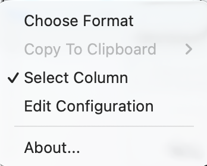

# CSVExamine plugin for Nextpad++

### Origin

This simple plugin started when a friend requested two things:
- A way to show which
column of large CSV files (*large number of columns and/or
rows*) contains the cell the mouse is hovering over.
* Be able to highlight a whole column to make it easier to see which
values are in the column (*values vary widely in size*).

Eventually, support for UTF-8 text (*primarily mathematical symbols*)
was requested, and general UTF-8 support was added.  There are a
couple small CSV files in the `test` folder with text in different
languages with different delimiters.

This was also an opportunity to finally learn Objective C/C++.  Looking
at other plugins helped solve some of the problems I ran into, but
many solutions required a lot of trial and error because of mostly
useless AI search results.

### CSVExamine Menu

- **Choose Format**
This menu option brings up a popup menu of formats that were defined in the `CSVExamine.ini` configuration file.
Hovering over each format on the menu will show a tooltip containing the format details. A format is basically:
	- A delimiter/separator (*e.g. comma or semicolon*).
	- The character that can enclose a cell value (*e.g. single or double quotes*).
	- The format for the tooltips that show up next to cells with the
header text and cell coordinates.
	- Which cell coordinate system to use in the tooltips (*A1 or R1C1*).

	See the `CSVExamine.ini` file for more detailed explanations.

- **Select Column**
When this flag is enabled, clicking the mouse in a cell selects all of the cell values in the column.

- **Copy To Clipboard**
When the `Select Column` flag is enabled, this submenu allows you to save all the selected cell values to the clipboard.
	- The `As Column` submenu item copies to the clipboard all selected cell values in the column with newlines between each.
	- The `As Row` submenu item copies to the clipboard all the selected cell values in the column with the delimiter/separator from the format being used.

- **Edit Configuration**
This menu option opens the `CSVExamine.ini` configuration file for editing. After making changes, save the file and restart Nextpad++.
Any syntax errors in the configuration file will be shown in an alert dialog when Nextpad++ starts.

### Other Details

This plugin will only look at files with names that end in `.csv` (*case-insensitive*). The menu is disabled for file names that do not end in `.csv`.

When a CSV file is opened, this plugin attempts to determine the format used.
If no matching format is found, an alert dialog comes up with instructions on what to do.

I'm working on a smarter algorithm to automatically determine the format and create it dynamically.

Send bug reports and feature requests to the email address below.
I may not get to them immediately, but I will get to them.

---
© 2026 Mark Leisher <<mleisher@duck.com>>
